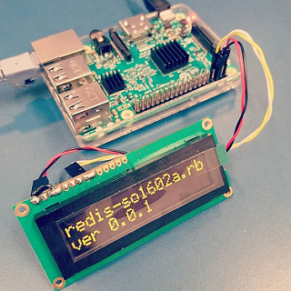
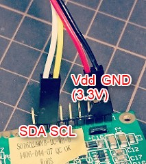
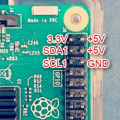
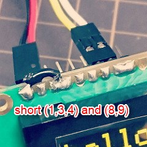

redis-so1602a.rb
====
A display driver program for SO1602A and Rapsberry Pi

How to setup
----

    $ sudo apt-get install redis-server redis-tools ruby
    $ sudo gem install redis
    $ sudo gem install i2c
    
    $ cd ~
    $ mkdir work
    $ cd work
    $ git clone https://github.com/yoggy/redis-so1602a
    $ cd redis-so1602a
    $ ./redis-so1602a.rb

How to use
----

    $ redis-cli set "so1602a:0" "hello SO1602A!!"
    $ redis-cli set "so1602a:1" "123456789abcdef"

OLED Character Display Module Pin Assign
----

    1 GND
    2 Vdd (3.3V)
    3 C/S (short to GND)
    4 I2C Slave Address (L->0x3c, H->0x3d)
    5 NC
    6 NC
    7 SCL (I2C clock)
    8 SDA IN (I2C data)
    9 SDA OUT (I2Cdata)
    10～14 NC
       ※ short (1,3,4) and (8,9)...

Raspberry Pi I2C Pin Assign
----

Copyright and license
----

Copyright (c) 2017 yoggy

Released under the [MIT license](LICENSE.txt)
